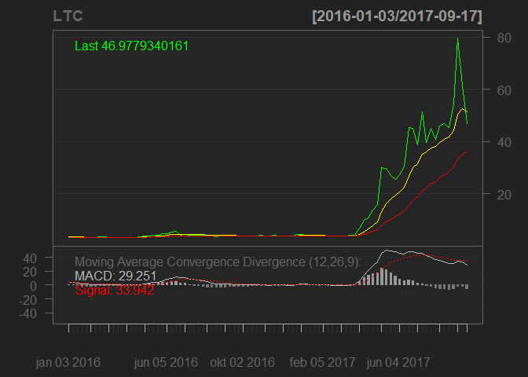
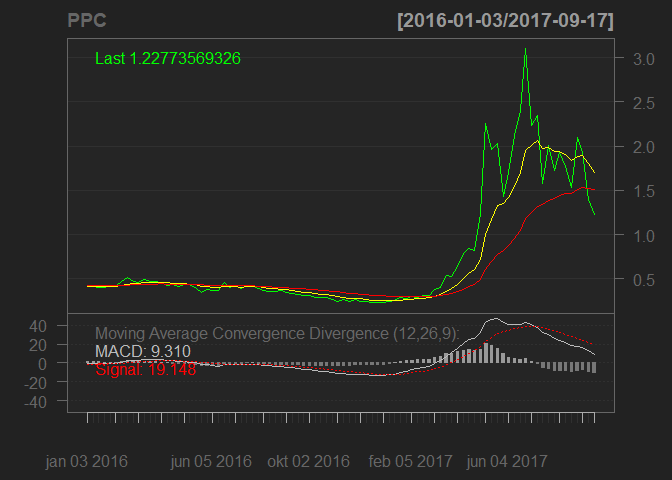
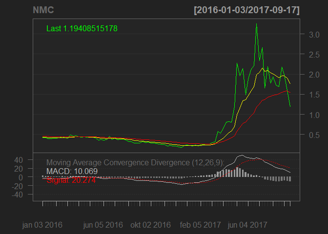
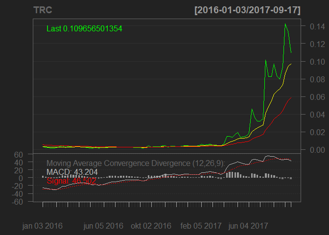
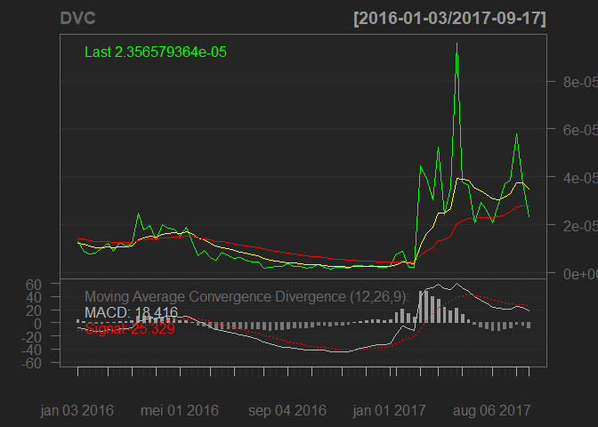
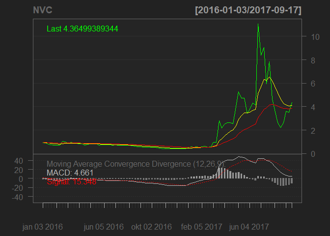
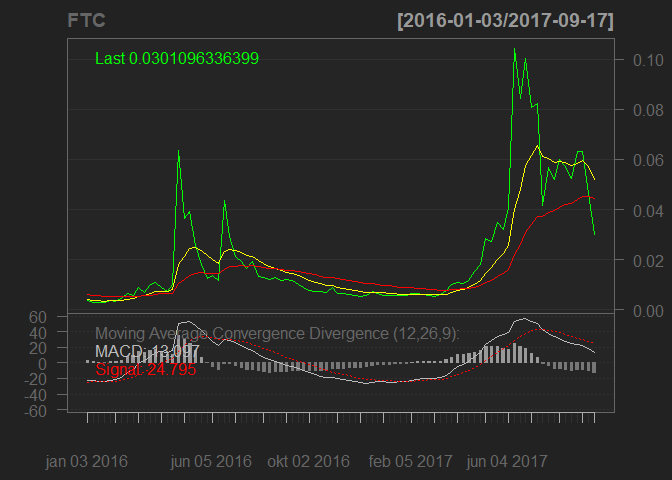
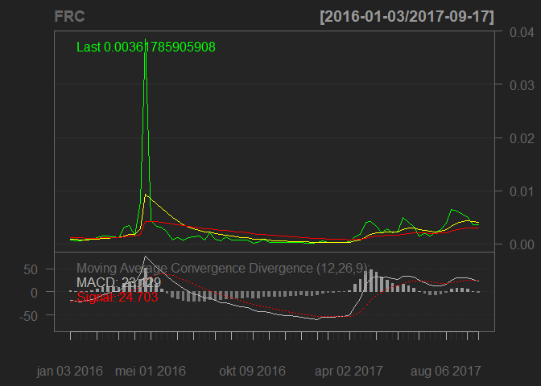

Web Scraping - Coinmarketcap.com Data
================

This repo contains a set of functions that can be used to scrape historical cryptocurrency market data from [coinmarketcap.com](https://coinmarketcap.com "coinmarketcap"):

-   `GetTotalCryptoCurrencyMarketCapitalization` - Fetch Cryptocurrency market capitalization data (total, bitcoin, alts).
-   `GetAllExistingTickers` - Fetch all available cryptocurrency tickers & symbol-id's over a given time period.
-   `GetHistoricalTimeseriesDataForTickers` - Fetch weekly timeseries data for a set of tickers over a given time period.
-   `GetHistoricalTopPerformingCoins` - Fetch market-cap rankings of top performing coins over a given time period.

Examples
========

### GetTotalCryptoCurrencyMarketCapitalization

``` r
source("config/Config.R")
first.date <- as.POSIXct("2013-04-28", format="%Y-%m-%d", tz="UTC")
last.date  <- as.POSIXct(Sys.Date() - lubridate::days(1), format="%Y-%m-%d", tz="UTC")

# Scraping coinmarketcap
# historical.market.cap <- GetTotalCryptocurrencyMarketCapitalization(first.date = first.date,
#                                                                     last.date  = last.date,
#                                                                     save.data  = TRUE)

## Loading the data from previously saved .rds file in ./data directory
historical.market.cap <- GetTotalCryptocurrencyMarketCapitalization(load.data = TRUE)


PlotChart <- function(chart.data, zoom="2016/2017", name=NULL){
  chart.alts <- chartSeries(chart.data, 
                            TA   = 'addEMA(n=10, col="yellow");addEMA(n=30, col="red");addMACD()', 
                            name = name, 
                            plot=FALSE)
  zoomChart(zoom)
}

PlotChart(historical.market.cap$alts, zoom="2016/2017", name = "Weekly Altcoin Market Cap")
```


### GetAllExistingTickers

``` r
# Scraping from coinmarketcap.com
# all.historical.tickers <- GetAllExistingTickers(first.date = first.date,
#                                                 last.date  = last.date,
#                                                 save.data  = TRUE)

# Loading the data from previously saved .rds file in ./data directory
all.historical.tickers <- GetAllExistingTickers(load.data = TRUE)

# Show amount of unique tickers
length(all.historical.tickers)
```

    ## [1] 1984

``` r
# Show first 100
head(all.historical.tickers, 100)
```

    ##             id-bitcoin            id-litecoin            id-peercoin 
    ##                  "BTC"                  "LTC"                  "PPC" 
    ##            id-namecoin           id-terracoin             id-devcoin 
    ##                  "NMC"                  "TRC"                  "DVC" 
    ##            id-novacoin         id-feathercoin            id-freicoin 
    ##                  "NVC"                  "FTC"                  "FRC" 
    ##             id-mincoin             id-chncoin              id-ixcoin 
    ##                  "MNC"                  "CNC"                  "IXC" 
    ##             id-bbqcoin              id-bitbar           id-worldcoin 
    ##                  "BQC"                  "BTB"                  "WDC" 
    ##              id-yacoin         id-digitalcoin            id-goldcoin 
    ##                  "YAC"                  "DGC"                  "GLD" 
    ##           id-luckycoin            id-memecoin              id-franko 
    ##                  "LKY"                  "MEM"                  "FRK" 
    ##        id-americancoin            id-junkcoin              id-nibble 
    ##                  "AMC"                  "JKC"                  "NBL" 
    ##             id-elacoin        id-bytecoin-bte         id-phoenixcoin 
    ##                  "ELC"                  "BTE"                  "PXC" 
    ##              id-bitgem            id-fastcoin            id-argentum 
    ##                  "BTG"                  "FST"                  "ARG" 
    ##           id-hypercoin            id-noirbits           id-primecoin 
    ##                  "HYC"                  "NRB"                  "XPM" 
    ##            id-megacoin        id-infinitecoin           id-craftcoin 
    ##                  "MEC"                  "IFC"                  "CRC" 
    ##          id-krugercoin           id-alphacoin          id-bottlecaps 
    ##                  "KGC"                  "ALF"                  "CAP" 
    ##          id-stablecoin            id-anoncoin           id-nanotoken 
    ##                  "SBC"                  "ANC"                  "NAN" 
    ##           id-doubloons              id-ezcoin             id-xencoin 
    ##                  "DBL"                  "EZC"                  "XNC" 
    ##          id-casinocoin               id-spots           id-lebowskis 
    ##                  "CSC"                  "SPT"                  "LBW" 
    ##              id-ripple id-cryptogenic-bullion             id-emerald 
    ##                  "XRP"                  "CBX"                  "EMD" 
    ##          id-globalcoin               id-quark            id-gamecoin 
    ##                  "GLC"                  "QRK"                  "GME" 
    ##                 id-gil            id-zetacoin          id-securecoin 
    ##                  "GIL"                  "ZET"                  "SRC" 
    ##          id-copperlark             id-tagcoin             id-tickets 
    ##                  "CLR"                  "TAG"                  "TIX" 
    ##       id-bitshares-pts          id-florincoin              id-i0coin 
    ##                  "PTS"                  "FLO"                  "I0C" 
    ##        id-colossuscoin                 id-nxt            id-datacoin 
    ##                  "COL"                  "NXT"                  "DTC" 
    ##             id-sexcoin      id-deutsche-emark            id-betacoin 
    ##                  "SXC"                  "DEM"                  "BET" 
    ##            id-dogecoin             id-netcoin          id-unobtanium 
    ##                 "DOGE"                  "NET"                  "UNO" 
    ##           id-tigercoin           id-grandcoin             id-diamond 
    ##                  "TGC"                  "GDC"                  "DMD" 
    ##  id-philosopher-stones           id-orbitcoin         id-hobonickels 
    ##                  "PHS"                  "ORB"                  "HBN" 
    ##           id-joulecoin          id-mastercoin           id-earthcoin 
    ##                  "XJO"                  "MSC"                  "EAC" 
    ##          id-memorycoin             id-catcoin           id-lottocoin 
    ##                  "MMC"                  "CAT"                  "LOT" 
    ##            id-asiccoin          id-fedoracoin         id-ronpaulcoin 
    ##                  "ASC"                 "TIPS"                  "RPC" 
    ##            id-dimecoin              id-ybcoin         id-extremecoin 
    ##                 "DIME"                  "YBC"                  "EXC" 
    ##              id-frozen              id-qqcoin             id-42-coin 
    ##                   "FZ"                  "QQC"                   "42" 
    ##              id-etoken            id-mooncoin               id-xivra 
    ##                 "ETOK"                 "MOON"                  "XIV" 
    ##            id-particle          id-kittehcoin             id-redcoin 
    ##                  "PRT"                 "MEOW"                  "RED" 
    ##            id-vertcoin 
    ##                  "VTC"

``` r
## Todo: In some cases, there exist multiple tickers for the same ticker-id.
## XLM/STR | LSK/LISK | ANS/NEO | there could potentially be others. (to fix..)
stellar <- "XLM"; names(stellar) <- "id-stellar"
lisk    <- "LSK"; names(lisk)    <- "id-lisk"
neo     <- "NEO"; names(neo)     <- "id-neo"
all.historical.tickers <- c(all.historical.tickers, stellar, lisk, neo)
```

### GetHistoricalTimeseriesDataForTickers

``` r
# Scraping from coinmarketcap.com
# historical.crypto.series <- GetHistoricalTimeseriesDataForTickers(tickers    = all.historical.tickers,
#                                                                   first.date = first.date,
#                                                                   last.date  = last.date,
#                                                                   save.data  = TRUE)

historical.crypto.series <- GetHistoricalTimeseriesDataForTickers(load.data = TRUE)
dim(historical.crypto.series)
```

    ## [1]  230 1987

``` r
# plot random selection of coin graphs
# note: make sure that data is available for the plotted serires
head(historical.crypto.series[, 1:10])
```

    ##                 BTC      LTC       PPC       NMC       TRC          DVC
    ## 2013-04-28 135.5806 4.334502 0.3896960 1.1841165 0.6545613 0.0003344067
    ## 2013-05-05 113.4565 3.525384 0.2972923 1.0459677 0.5626222 0.0002745866
    ## 2013-05-12 116.0678 3.364775 0.2498815 0.8532856 0.4044813 0.0002230046
    ## 2013-05-19 123.0991 3.342241 0.1910149 0.8280584 0.3719439 0.0001913227
    ## 2013-05-26 131.9626 3.150428 0.2074220 0.9413493 0.3420832 0.0001983726
    ## 2013-06-02 126.9006 2.799870 0.1569073 0.7395194 0.2640472 0.0001560896
    ##                 NVC        FTC        FRC        MNC
    ## 2013-04-28 4.209044         NA         NA         NA
    ## 2013-05-05 3.531343 0.40064561 0.10715038 0.16689494
    ## 2013-05-12 3.539670 0.12560110 0.04241313 0.22077914
    ## 2013-05-19 3.655139 0.12709005 0.03183514 0.20213766
    ## 2013-05-26 4.216145 0.09950913 0.03186484 0.11527688
    ## 2013-06-02 4.087924 0.08349554 0.02167734 0.07245189

``` r
tail(historical.crypto.series[, 1:10])
```

    ##                 BTC      LTC      PPC      NMC        TRC          DVC
    ## 2017-08-13 4071.580 46.73837 1.774674 1.723212 0.08282648 2.877644e-05
    ## 2017-08-20 4131.818 45.19869 1.530369 1.689356 0.08004440 3.726089e-05
    ## 2017-08-27 4358.812 54.44645 2.093768 2.172294 0.09318900 3.879430e-05
    ## 2017-09-03 4632.253 79.66460 1.924867 1.982516 0.14242856 5.801504e-05
    ## 2017-09-10 4083.698 61.47833 1.399326 1.597353 0.13358018 3.761964e-05
    ## 2017-09-17 3536.838 46.97793 1.227736 1.194085 0.10965650 2.356579e-05
    ##                 NVC        FTC         FRC MNC
    ## 2017-08-13 2.652540 0.05714651 0.006480706  NA
    ## 2017-08-20 2.196532 0.05220034 0.006106207  NA
    ## 2017-08-27 2.634708 0.06316251 0.005591865  NA
    ## 2017-09-03 3.605879 0.06330130 0.005117176  NA
    ## 2017-09-10 3.519925 0.04655235 0.003582203  NA
    ## 2017-09-17 4.364994 0.03010963 0.003617859  NA

``` r
chart.it <- sapply(2:9, function(x) PlotChart(historical.crypto.series[,x],
                                              name = names(historical.crypto.series[,x])))
```



``` r
########
## todo: In some cases, There exist multiple ticker-id's for the same ticker symbol
## ex, ETC corresponds to'id-ethercoin' and 'id-ethereum-classic'
# There could potentially be others as well (to fix)
# etc.tickers        <- "ETC"
# names(etc.tickers) <- "id-ethereum-classic"
# etc <- GetWeeklyTimeseriesDataForTickers(tickers    = etc.tickers,
#                                          first.date = first.date,
#                                          last.date  = last.date)
# # add id-ethereum-classic
# historical.crypto.series <- cbind(historical.crypto.series, etc)
```

### GetHistoricalTopPerformingCoins

``` r
# Scraping from coinmarketcap.com
# nr.top.coins = 10
# historical.top.coins <- GetHistoricalTopPerformingCoins(nr.top.coins = 10,
#                                                         first.date   = first.date,
#                                                         last.date    = last.date,
#                                                         save.data    = TRUE)

historical.top.coins <- GetHistoricalTopPerformingCoins(load.data = TRUE)

head(historical.top.coins)
```

    ##              1   2   3   4   5   6   7    8    9   10
    ## 2013-04-28 BTC LTC PPC NMC TRC DVC NVC <NA> <NA> <NA>
    ## 2013-05-05 BTC LTC NMC PPC FTC FRC TRC  DVC  NVC  MNC
    ## 2013-05-12 BTC LTC PPC NMC TRC DVC NVC  FRC  FTC  CNC
    ## 2013-05-19 BTC LTC NMC PPC NVC TRC DVC  FTC  FRC  CNC
    ## 2013-05-26 BTC LTC NMC PPC NVC TRC DVC  FRC  FTC  CNC
    ## 2013-06-02 BTC LTC NMC PPC NVC TRC DVC  FTC  FRC  CNC

``` r
tail(historical.top.coins)
```

    ##              1   2   3   4     5    6     7     8     9  10
    ## 2017-08-13 BTC ETH XRP BCH   LTC  XEM MIOTA   NEO  DASH ETC
    ## 2017-08-20 BTC ETH BCH XRP MIOTA  XEM   LTC  DASH   NEO ETC
    ## 2017-08-27 BTC ETH BCH XRP  DASH  LTC MIOTA   XEM   XMR NEO
    ## 2017-09-03 BTC ETH BCH XRP   LTC  XEM  DASH MIOTA   XMR ETC
    ## 2017-09-10 BTC ETH BCH XRP   LTC DASH   XEM   XMR MIOTA ETC
    ## 2017-09-17 BTC ETH BCH XRP   LTC DASH   XEM   XMR MIOTA NEO

Donations
---------

If you find this software useful and/or you would like to see additional extensions, feel free to donate some crypto:

-   BTC: 1QHtZLZ15Cmj4FPr5h5exDjYciBDhh7mzA
-   LTC: LhKf6MQ7LY1k8YMaAq9z3APz8kVyFX3L2M
-   ETH: 0x8E44D7C96896f2e0Cd5a6CC1A2e6a3716B85B479
-   DASH: Xvicgp3ga3sczHtLqt3ekt7fQ62G9KaKNB

Or preferably, donate some of my favorite coins :)

-   GAME: GMxcsDAaHCBkLnN42Fs9Dy1fpDiLNxSKX1
-   WAVES: 3PQ8KFdw2nWxQATsXQj8NJvSa1VhBcKePaf

Licensing
---------

Copyright 2017 Essential Data Science Consulting ltd. ([EssentialQuant.com](http://essentialquant.com "EssentialQuant") / <jellenvermeir@essentialquant.com>). This software is copyrighted under the MIT license: View added [LICENSE](./LICENSE) file.
